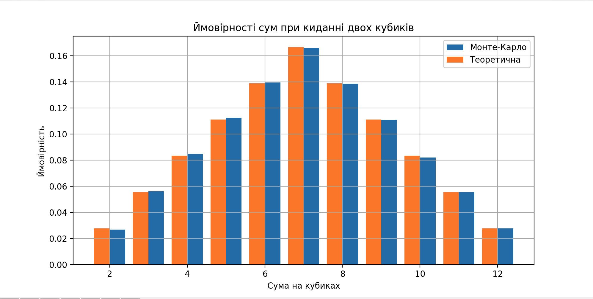

# Моделювання кидання двох гральних кубиків методом Монте-Карло

## Опис завдання

Метою даного проєкту є імітація великої кількості кидків двох гральних кубиків для визначення ймовірності появи кожної можливої суми очок (від 2 до 12). Моделювання виконано за допомогою методу Монте-Карло, а отримані результати порівняно з теоретичними аналітичними ймовірностями.

## Метод

Для реалізації використано метод **Монте-Карло**: випадковим чином моделюється велика кількість кидків кубиків (наприклад, 100 000), після чого обчислюється частота кожної можливої суми.

## Аналітичні ймовірності

Сума | Кількість комбінацій | Ймовірність
---- | -------------------- | ------------
2    | 1                    | 1/36 ≈ 2.78%
3    | 2                    | 2/36 ≈ 5.56%
4    | 3                    | 3/36 ≈ 8.33%
5    | 4                    | 4/36 ≈ 11.11%
6    | 5                    | 5/36 ≈ 13.89%
7    | 6                    | 6/36 ≈ 16.67%
8    | 5                    | 5/36 ≈ 13.89%
9    | 4                    | 4/36 ≈ 11.11%
10   | 3                    | 3/36 ≈ 8.33%
11   | 2                    | 2/36 ≈ 5.56%
12   | 1                    | 1/36 ≈ 2.78%

## Результати симуляції

- Метод Монте-Карло показав розподіл ймовірностей, що дуже близький до аналітичного.
- Графік демонструє, що суми ближчі до центру (наприклад, 6, 7, 8) мають більшу ймовірність, що співпадає з теоретичними передбаченнями.

## Візуалізація

## Висновки

- Метод Монте-Карло дозволяє точно змоделювати розподіл ймовірностей сум при киданні двох кубиків.
- Результати симуляції збігаються з аналітичними розрахунками.
- Модель можна використовувати для навчання основ теорії ймовірностей та моделювання випадкових подій.
